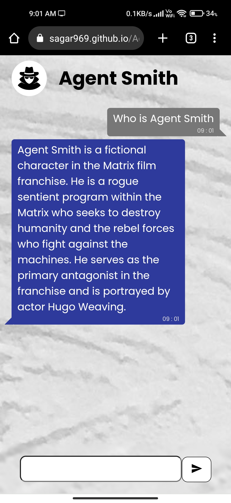

# Agent Smith Chatbot

Agent Smith is an advace chatbot with the power of Chatgpt-3.5 by OpenAI.

For live site view, [Click here](https://sagar969.github.io/Agent-Smith-chatbot/)

## Table of contents

- [Overview](#overview)
  - [The Product](#the-product)
  - [Screenshots](#screenshots)
    - [Desktop view](#desktop-view)
    - [Mobile view](#mobile-view)
  - [Links](#links)
- [My process](#my-process)
  - [Built with](#built-with)
- [Author](#author)

## Overview

### The Product

In this app users can:

- talk to chatbot
- ask their queries and get the responses.
- can ask for code snippets and other useful materials.

### Screenshots

This app is responsive to every screen size out there.
Desktop and Mobile view -

#### Desktop View

#### Mobile View

### Links

- Source code URL: [Source Code](https://github.com/Sagar969/Agent-Smith-chatbot)
- Live Site URL: [Live Site](https://sagar969.github.io/Agent-Smith-chatbot/)

## My process

### Built with

- [React](https://reactjs.org/) - JS library
- [Styled Components](https://styled-components.com/) - For animation styling
- [OpenAI API](https://openai.com/blog/openai-api)

## Author

- Profile - [Sagar Mavai](https://github.com/Sagar969/)
- LinkedIn - [Sagar Mavai](https://www.linkedin.com/in/sagar-mavai-986b25206)
- Twitter - [@sagarmavai](https://www.twitter.com/sagarmavai)
